  

  

## 📌 About Me
- 🤖 AI Systems Engineer & Full-Stack Developer
- 📍 Based in Bengaluru, India
- 🚀 I build and ship production-grade AI-native products end-to-end — from model integration and multi-agent pipelines to real-time dashboards and secure deploys.
- 🔧 Focus on the "last mile": making AI actually usable through tight UIs, hardened back-ends, and practical applications in legal, forensics, ops, and cybersecurity.
- 🔄 Currently rebuilding in public — all featured projects are deployed, documented, and live.

## 🧠 My Focus Areas
- 🧠 AI Systems Engineering (tool-use, multi-agent pipelines, RAG)
- ⚛️ Full-Stack Development
- 📡 Real-time Observability & LLMOps (WebSockets, dashboards, metrics)
- 🔐 Cybersecurity & Ops Intelligence
- 🕵️ Privacy-first AI applications & Digital Forensics
- ⚖️ Legal tech (contract analysis, risk flagging)
- 🤝 Agentic workflows & Autonomous systems
- 🛡️ Production hardening (auth, sandboxing, rate limiting)
- 🌍 Building in public with live demos and documentation

## 📦 Featured Projects

<table>
<tr>
<td width="50%" valign="top">

### 👁️ [The Witness](https://github.com/crastatelvin/the-witness)

Deep Telemetry & Non-Dual Intervention Engine. Monitors native OS stress (CPU/RAM) and pushes live philosophical AI interventions to an animated, God-level glassmorphism dashboard.

**Stack:** Next.js 14 · Node.js · WebSockets · Tailwind CSS · Framer Motion

</td>
<td width="50%" valign="top">

### 📡 [PULSE LLMOps](https://github.com/crastatelvin/pulse-llmops)

Real-Time LLMOps Monitoring and Observability Platform. Captures LLM calls, tracks latency/tokens/costs, and pushes insights to a live KPI dashboard over WebSockets.

**Stack:** FastAPI · React 18 · SQLite · WebSockets

</td>
</tr>
<tr>
<td width="50%" valign="top">

### 🔥 [FORGE — MCP Tool Server](https://github.com/crastatelvin/forge-mcp-server)

Universal MCP server exposing 10 sandboxed tools over HTTP, WebSocket, and MCP's native shape. Premium React dashboard with live stats, interactive tool tester, and inline Claude chat.

**Stack:** FastAPI · Pydantic 2 · React 18 · WebSocket · Anthropic

🌐 [Live Demo](https://forge-mcp-server.vercel.app) · 📚 [API Docs](https://forge-mcp-server.onrender.com/docs)

</td>
<td width="50%" valign="top">

### 🧠 [NEXUS Research](https://github.com/crastatelvin/nexus-research)

Multi-agent research platform. Four specialized agents collaborate through a live ReactFlow pipeline, streaming progress over WebSockets and exporting a branded PDF brief.

**Stack:** FastAPI · Groq (LLaMA 3.3) · React 19 · ReactFlow · jsPDF

🌐 Live Demo *(coming soon)*

</td>
</tr>
<tr>
<td width="50%" valign="top">

### ⚖️ [Clause AI](https://github.com/crastatelvin/clause-ai)

Legal contract risk analyzer. Upload any contract or NDA → AI flags dangerous clauses, missing protections, and one-sided terms with negotiation advice in plain English.

**Stack:** FastAPI · Groq · React · NLP · PDF parsing

</td>
<td width="50%" valign="top">

### 🔐 [Sentinel AI](https://github.com/crastatelvin/sentinel-ai)

Real-time cybersecurity threat dashboard. Upload server logs → AI classifies attacks, maps global origins, and generates remediation playbooks.

**Stack:** FastAPI · Gemini · React · WebSockets · log parsing

</td>
</tr>
<tr>
<td width="50%" valign="top">

### 📊 [Ops Intelligence Copilot](https://github.com/crastatelvin/ops-intelligence-copilot)

Upload CSV/Excel ops data → ask questions in plain English → get KPI summaries, anomaly detection, and dynamic charts. Natural-language BI for small teams.

**Stack:** FastAPI · Gemini Flash · React · pandas · Recharts

</td>
<td width="50%" valign="top">

### 🧪 [Forensic AI Lab](https://github.com/crastatelvin/forensic-ai-lab)

Hands-on digital forensics toolkit. Evidence analysis, anomaly detection, and simulated investigations using ML + local LLMs. Built for DFIR learning.

**Stack:** Python · Flask · Ollama · scikit-learn · forensic workflows

</td>
</tr>
</table>

## 📊 GitHub Stats & Trophies

  
  

  

  

  

## 🛠️ Languages & Tools

<h3 align="center">Programming Languages</h3>

  &nbsp;&nbsp;&nbsp;&nbsp;
  &nbsp;&nbsp;&nbsp;&nbsp;
  &nbsp;&nbsp;&nbsp;&nbsp;
  &nbsp;&nbsp;&nbsp;&nbsp;
  

<h3 align="center">Frontend</h3>

  &nbsp;&nbsp;&nbsp;&nbsp;
  &nbsp;&nbsp;&nbsp;&nbsp;
  &nbsp;&nbsp;&nbsp;&nbsp;
  &nbsp;&nbsp;&nbsp;&nbsp;
  

<h3 align="center">Backend</h3>

  &nbsp;&nbsp;&nbsp;&nbsp;
  &nbsp;&nbsp;&nbsp;&nbsp;
  &nbsp;&nbsp;&nbsp;&nbsp;
  

<h3 align="center">Database</h3>

  &nbsp;&nbsp;&nbsp;&nbsp;
  &nbsp;&nbsp;&nbsp;&nbsp;
  &nbsp;&nbsp;&nbsp;&nbsp;
  

<h3 align="center">DevOps & Cloud</h3>

  &nbsp;&nbsp;&nbsp;&nbsp;
  &nbsp;&nbsp;&nbsp;&nbsp;
  &nbsp;&nbsp;&nbsp;&nbsp;
  &nbsp;&nbsp;&nbsp;&nbsp;
  

<h3 align="center">Tools</h3>

  &nbsp;&nbsp;&nbsp;&nbsp;
  &nbsp;&nbsp;&nbsp;&nbsp;
  &nbsp;&nbsp;&nbsp;&nbsp;
  &nbsp;&nbsp;&nbsp;&nbsp;
  &nbsp;&nbsp;&nbsp;&nbsp;
  

  

 

## 🔗 Connect with Me

  &nbsp;&nbsp;
  

  

### A quick note on the contribution graph

*This is my 2025 rebuild after losing access to my previous GitHub account. Everything pinned above is what I've shipped since — every project is deployed, every README is real, every live demo is reachable. The graph will thicken from here; the work speaks for itself in the meantime.*

 

⭐ **If any of the projects above saved you time — or you want to talk MCP, agents, or AI-native product work — star a repo or drop me a line.**

