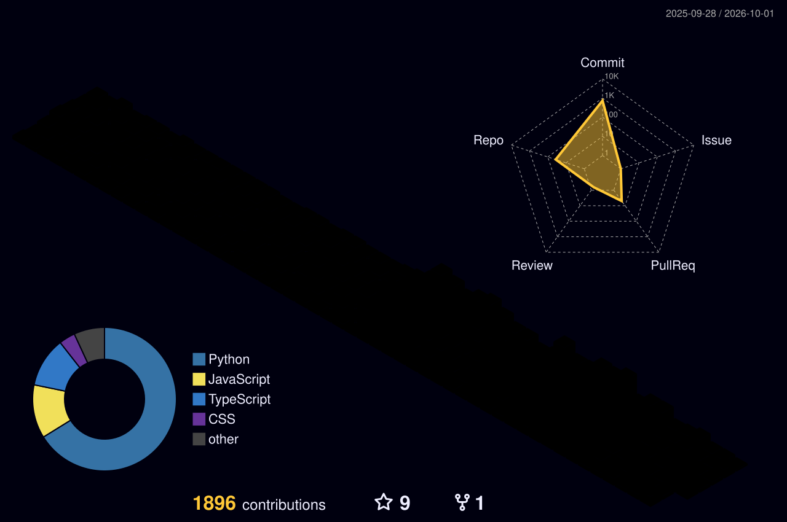
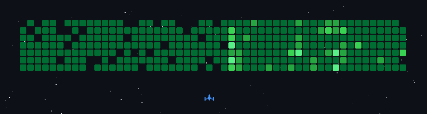

  

  
  &nbsp;
  
  &nbsp;
  

  

  

  &nbsp;&nbsp;
  &nbsp;&nbsp;
  &nbsp;&nbsp;
  <a href="https://forge-mcp-server.vercel.app" target="_blank"></a>&nbsp;&nbsp;
  &nbsp;&nbsp;
  <a href="https://telvyn-hybrid-ai-1111.streamlit.app/" target="_blank"></a>&nbsp;&nbsp;
  <a href="https://crastatelvin.github.io/ONYX/" target="_blank"></a>&nbsp;&nbsp;
  

  

  

  

<a href="https://github.com/crastatelvin/Documind"></a>
<a href="https://github.com/crastatelvin/Telvyn-Hybrid-AI"></a>

<a href="https://github.com/crastatelvin/forge-mcp-server"></a>
<a href="https://github.com/crastatelvin/ONYX"></a>

<a href="https://github.com/crastatelvin/clause-ai"></a>
<a href="https://github.com/crastatelvin/sentinel-ai"></a>

<a href="https://github.com/crastatelvin/nexus-research"></a>
<a href="https://github.com/crastatelvin/GearFlow"></a>

<a href="https://ashtavakra-gita-summit.vercel.app"></a>
<a href="https://github.com/crastatelvin/self-healing-docs-agent"></a>

<a href="https://github.com/crastatelvin/forensic-ai-lab"></a>
<a href="https://github.com/crastatelvin/mnemo-memory-os"></a>

<a href="https://github.com/crastatelvin/the-witness"></a>
<a href="https://github.com/crastatelvin/pulse-llmops"></a>

  

<h3>🧊 3D Contribution Graph</h3>

  

  

<kbd>🧠 &nbsp; A I &nbsp; / &nbsp; L L M s</kbd>



<kbd>💻 &nbsp; L A N G U A G E S &nbsp; & &nbsp; F R A M E W O R K S</kbd>



<kbd>☁️ &nbsp; D A T A &nbsp; · &nbsp; D E V O P S &nbsp; · &nbsp; M L</kbd>

  

  &nbsp;&nbsp;&nbsp;&nbsp;
  &nbsp;&nbsp;&nbsp;&nbsp;
  &nbsp;&nbsp;&nbsp;&nbsp;
  &nbsp;&nbsp;&nbsp;&nbsp;
  

### A quick note on the contribution graph

*This is my 2025 rebuild after losing access to my previous GitHub account. Everything pinned above is what I've shipped since — every project is deployed, every README is real, every live demo is reachable. The graph will thicken from here; the work speaks for itself in the meantime.*

 

⭐ **If any of the projects above saved you time — or you want to talk MCP, agents, or AI-native product work — star a repo or drop me a line.**

<h3>👾 Contribution Space Shooter</h3>

  

  

